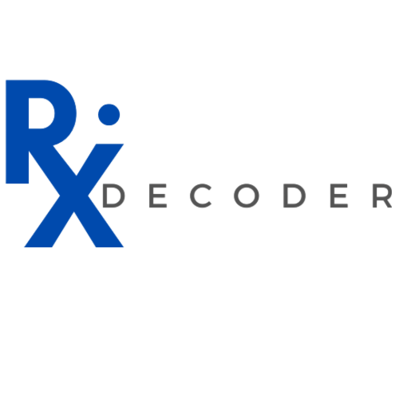
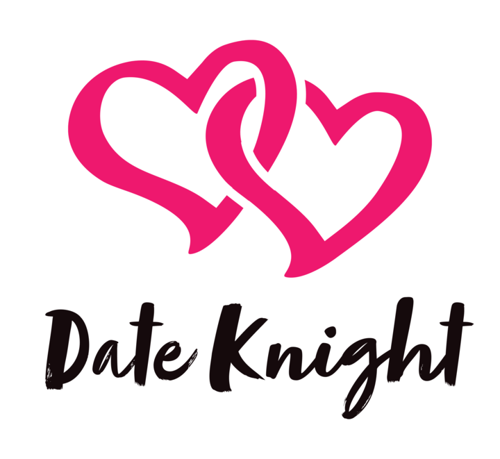

# Mikaela Virtucio
## About Me

*A programmer that embraces their cognitive masochism*

- I am an junior software developer
- Student in Code Institute
- Hackathon enthuist

## 🌐 Socials:
 

# 💻 Tech Stack:
          
# Projects:

### [Rx Decoder](https://github.com/mikavir/rx-decoder 'repository')

*Ongoing Project*

An interactive game application using JavaScript to guess the drug name. 

*Technologies Used:*
- HTML5
- CSS3
- Bootstrap
- JavaScript
- JQuery
- JQuery UI
- JQuery UI Touch Punch
- Jest testing - *to practice Test Driven Deployment*

### [HeartCare Hub](https://github.com/mikavir/heartcare-hub 'repository')

*Technology Used:*
- HTML5
- CSS3
- Bootstrap

### [HealthDiary Keeper](https://github.com/mikavir/health-diary-keeper 'repository')

*Technologies Used:*
- HTML5
- CSS3
- Bootstrap
- Python
- Flask
- SQL

## Collaborative Projects:

### [Date Knight](https://github.com/mikavir/date-knight 'repository')

 A collabarative project created for Code Institute February Hackathon

*Technology used:*
- Python
- Django
- Django-Tailwind
- JavaScript
- Jinja
- PostgreSQL

# 📊 GitHub Stats:
 
 

---

<!-- Proudly created with GPRM ( https://gprm.itsvg.in ) -->
